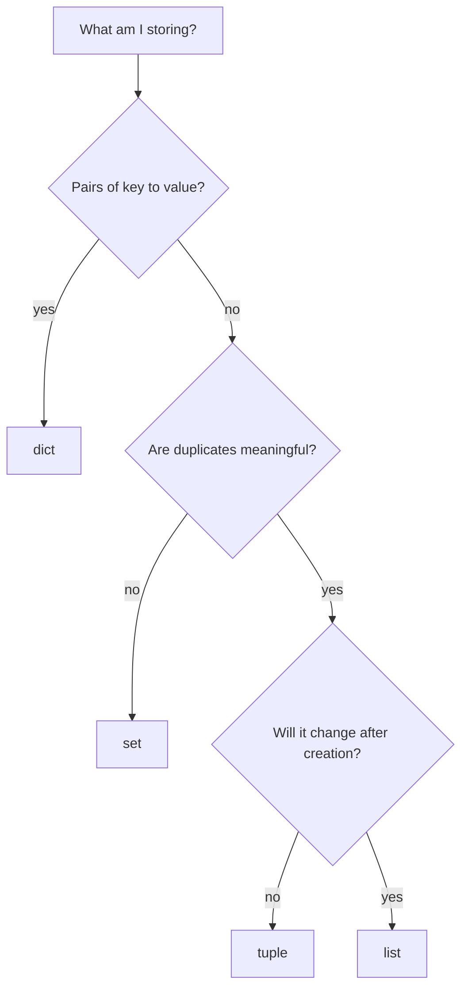

# Collections: list, tuple, dict, set

> Four containers, one question at a time: **which one for which need**. This intro is the recap I want to reread before an exam. Each type is detailed further down.

- https://docs.python.org/3/library/stdtypes.html

---

## 1. Pick by use case

| I need to… | Use | Why |
| --- | --- | --- |
| keep items in order, and change them later | [`list`](#lists) | ordered, mutable, indexable |
| return several values from a function | [`tuple`](#tuples) | packing and unpacking are free |
| hand out data nobody should modify | [`tuple`](#tuples) | no mutation method exists at all |
| ask "is X in there?" very often | [`set`](#sets) | O(1) membership, a list is O(n) |
| drop duplicates | [`set`](#sets) | uniqueness *is* the data structure |
| compare two groups (common, missing, exclusive) | [`set`](#sets) | `&`, `\|`, `-`, `^` built in |
| look a value up by name or id | [`dict`](#dictionaries) | key to value in O(1) |
| count occurrences | [`dict`](#dictionaries) | key = the item, value = its counter |
| group items by category | [`dict`](#dictionaries) | key = the category, value = a list |
| use a collection as a dict key or a set member | `tuple` / `frozenset` | both are hashable, `list` and `set` are not |
| deduplicate **and** keep insertion order | `dict.fromkeys(items)` | dict keys are unique and ordered (3.7+) |

Two rows to reread: "hashable" and "O(1)". Almost every wrong choice below comes from ignoring one of those two, and both get their own table further down.

## 2. Same thing as a decision tree



Three questions, never more. The first one is the real fork: as soon as an item*points to* another, it is a `dict`, whatever the rest.

## 3. Identity card

The four I actually choose between, then (empty column) the three sequences I never choose: `str`, `range` and `bytes` come from the data itself, they are here only to show how much behaviour is shared.

| | `list` | `tuple` | `dict` | `set` | | `str` | `range` | `bytes` |
| --- | --- | --- | --- | --- | --- | --- | --- | --- |
| Holds | anything | anything | key: value pairs | hashables only | | text (code points) | nothing, ints computed | bytes, 0 to 255 |
| Literal | `[1, 2]` | `(1, 2)` | `{"a": 1}` | `{1, 2}` | | `"abc"` | `range(5)` | `b"abc"` |
| Empty | `[]` | `()` | `{}` | `set()` ⚠️ | | `""` | `range(0)` | `b""` |
| Ordered | yes | yes | yes (3.7+) | **no** | | yes | yes | yes |
| Mutable | yes | **no** | yes | yes | | no | no | no (`bytearray`: yes) |
| Access by index `c[0]` | yes | yes | by key only | **no** | | yes | yes | yes (gives an `int`) |
| Sliceable `c[1:3]` | yes | yes | no | no | | yes | yes | yes |
| Duplicates allowed | yes | yes | keys: no, values: yes | **no** | | yes | no | yes |
| Hashable (usable as dict key) | no | yes * | no | no (`frozenset`: yes) | | yes | yes | yes |
| What `in` tests | items | items | **keys only** | items | | **substring** | membership, in O(1) | subsequence |

\* a tuple is hashable only if everything inside it is.

The two rows where the right block does not behave like the left one:

```python
>>> "ell" in "hello"        # substring test, not "one item of the sequence"
True
>>> 999_999 in range(10**9) # arithmetic, no scan, instant
True
```

The four traps hidden in that table:

```python
>>> type({})          # empty braces are a dict, never a set
<class 'dict'>
>>> type({1})         # one item and it becomes a set
<class 'set'>
>>> type((1))         # parentheses alone group, they do not build a tuple
<class 'int'>
>>> type((1,))        # the comma is what makes the tuple
<class 'tuple'>
>>> hash((1, [2]))
TypeError: unhashable type: 'list'
```

## 4. Cost, which is where the choice really matters

| Operation | `list` | `tuple` | `dict` | `set` |
| --- | --- | --- | --- | --- |
| `x in c` | O(n) | O(n) | O(1) (keys) | O(1) |
| access by index / key | O(1) | O(1) | O(1) | not possible |
| append / add | O(1) | not possible | O(1) | O(1) |
| insert or delete at the front | O(n) | not possible | not ordered by position | not ordered |
| len(c) | O(1) | O(1) | O(1) | O(1) |

O(1) on `dict` and `set` is the same mechanism: the item is hashed, and the hash says where to look. A `list` has to walk every element until it finds a match, which is exactly why "test membership in a loop over a big list" is the classic slow code.

## 5. When a built-in is not enough (later doc)

Info only, these get their own note.

| Need | Tool | In one line |
| --- | --- | --- |
| count occurrences | `collections.Counter` | a dict that counts, plus `.most_common()` |
| a default value instead of `KeyError` | `collections.defaultdict` | missing key creates its value |
| push and pop on both ends | `collections.deque` | O(1) on the left, a list is O(n) |
| a tuple with named fields | `collections.namedtuple` | `p.x` instead of `p[0]` |
| a set usable as a dict key | `frozenset` (built-in) | immutable, therefore hashable |

---

## Lists

> To write.

## Tuples

> To write.

## Dictionaries

### `in` tests keys only, never values

```python
d = {"a": 1, "b": 2}
"a" in d   # True  — "a" is a key
1 in d     # False — 1 is a value, not a key
```

To test values explicitly: `1 in d.values()`. To test both: `1 in d or 1 in d.values()` (the first half is redundant with `in d.keys()`, since `in d` already means that).

Not just a syntax distinction — a complexity one:

| Test | Complexity | Why |
| --- | --- | --- |
| `key in d` | O(1) | hash lookup, same as `key in d.keys()` |
| `value in d.values()` | O(n) | linear scan — values aren't hashed/indexed |

See [python_keywords.md](../02_syntax_flow/python_keywords.md) for `in` as a general keyword (also drives `for` loops, tests list/set/tuple membership too).

### `.keys()` returns a view, not a list

```python
d = {"apple": 5, "banana": 3}
k = d.keys()
k            # dict_keys(['apple', 'banana'])
type(k)      # <class 'dict_keys'>
```

- **Live view, not a snapshot** — mutating `d` after the call updates `k` automatically, no need to call `.keys()` again.
- **Iterable**, usable directly in `for key in d.keys():` (or just `for key in d:`) — no need to convert it for iteration.
- **Not indexable** — `d.keys()[0]` raises `TypeError`.
- **`list(d.keys())`** converts it to a real, indexable, "frozen" (snapshot-at-call-time) list — also changes the repr from `dict_keys([...])` to `[...]`, useful for clean display (e.g. `print(list(inventory.keys()))`).

### `.update()` — every accepted syntax

`d.update(...)` mutates `d` in place and always returns `None`. It accepts one positional argument (of several possible shapes), keyword arguments, or both:

```python
d = {"a": 1, "b": 2}

d.update({"b": 20, "c": 3})        # 1. another dict — merges/overwrites keys
d.update(b=20, c=3)                # 2. keyword arguments — same effect
d.update([("b", 20), ("c", 3)])    # 3. iterable of (key, value) pairs (tuples/lists)
d.update(zip(["b", "c"], [20, 3])) # 4. any iterable of 2-length iterables — zip() included
d.update({"c": 3}, b=20)           # 5. positional dict + kwargs — kwargs applied after,
                                   #    so kwargs win on key conflicts
d.update()                         # 6. no argument — no-op
```

Existing keys are overwritten, new keys are added — nothing is ever removed.

**Alternative (Python ≥ 3.9): merge operators**

```python
d |= {"b": 20, "c": 3}        # in-place merge, equivalent to d.update(...)
merged = d | {"c": 3}         # new dict, d itself untouched (update() has no non-mutating form)
```

**Link with `d[key] = val`**

| | `d[key] = val` | `d.update(...)` |
|---|---|---|
| Keys touched | exactly one | one or many at once |
| Source | a single value | a dict, kwargs, or an iterable of pairs |
| Use case | set/overwrite a single known key | merge in a batch of key/value pairs |

`d.update({"b": 20})` is functionally equivalent to `d["b"] = 20` for a single key — `.update()` is really `[key] = val` generalized to many keys in one call.

## Sets

> To write.

## Building these collections

Which brackets build which type, eager vs lazy, `all()`/`any()`, the empty-iterable traps: [python_comprehensions.md](python_comprehensions.md).
