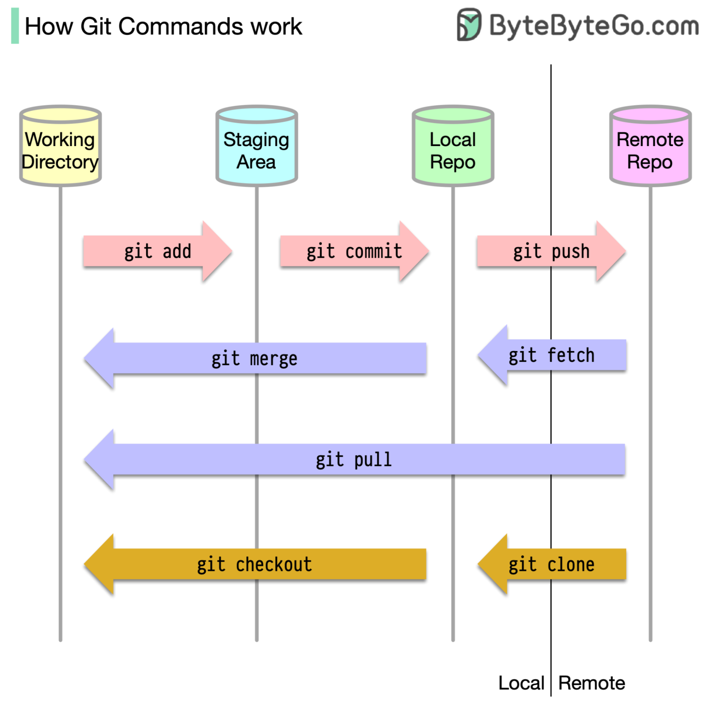

# Basics


- `git add <file/folder>` 
- `git rm <file/folder>`
- `git status`
- `git commit -m "add file.txt"`
- `git log`
- `git restore`: Restore a file after a `git rm`


# Delete last commit

```bash
# Will keep the file(s) modified by in working directory, they will appear as unstaged
git reset --soft HEAD~1
# Will erase the file or the changes from workind directory
git reset --hard HEAD~1
```
# Delete commit already pushed

```bash
# Will reset the branch to the specified commit
git reset --hard #<commit_id>#
# Need -f --force if the commit have been already pushed to remote repo.
git push -f 
```

### Modify last commit

```bash
git add <file>
git commit --amend --no-edit
git push
# git push --force if already pushed on remote
```
# Change remote

```bash
#repo_url=...
git remote add "origin" "$repo_url"
git remote set-url "origin" "$repo_url"
```


# Get list of file on repo

local 
```bash
git ls-tree -r master
```

remote 
```bash
git ls-tree -r origin/master
```
